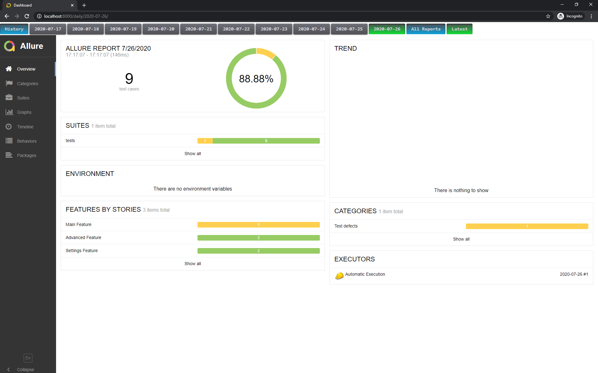
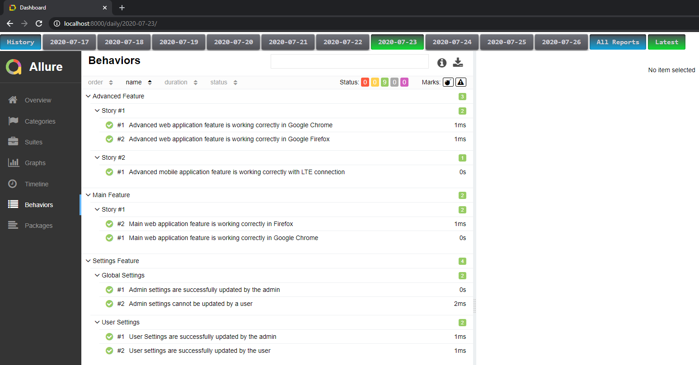
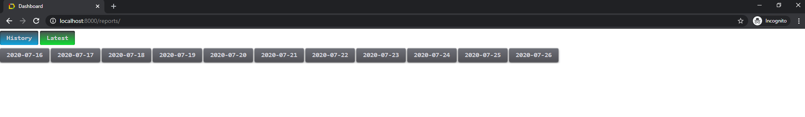
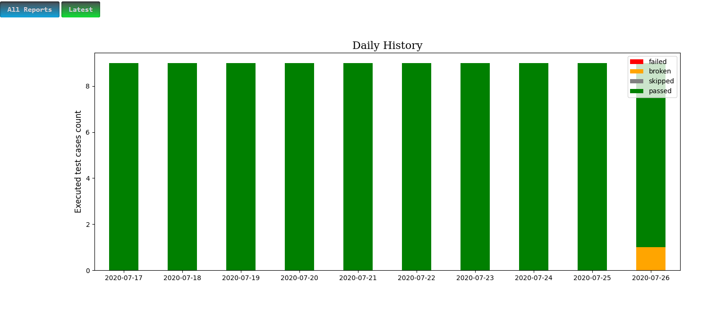

# Daily Allure Reports
This web application is created to assemble all asynchronously uploading allure-results in the single report.

If you have multiple Test Automation projects with different bunches of tests and you want to get their latest results in one report then this app will be helpful for you.

The main idea is to upload results of all tests to the daily report. Then at the end of a day you will see how many of your tests were passed/failed/broken/skipped. 
If the certain test failed and then passed during the same date then the result will overriten to the latest one ("passed").

This application is based on ["allure-docker-service"](https://github.com/fescobar/allure-docker-service)  project.


## Installation with Docker:
#### 1. Create a new directory.
#### 2. Create following `docker-compose.yml` file in the created directory:
```.yaml
version: "3.8"

services:
  allure_docker_service_ui:
    image: jamalzeinalov/allure_docker_service_ui
    container_name: allure_docker_service_ui
    environment:
      ALLURE_SERVICE_CONTAINER: allure_docker_service
    ports:
      - "8000:8000"
    depends_on:
      - allure_docker_service
    networks:
      - app-net
    volumes:
      - ./target/allure-results:/code/target/allure-results
      - ./target/default-reports:/code/target/default-reports
      - ./target/projects:/code/target/projects

  allure_docker_service:
    image: frankescobar/allure-docker-service
    container_name: allure-service
    environment:
      CHECK_RESULTS_EVERY_SECONDS: 5
      KEEP_HISTORY: "FALSE"
    ports:
      - "5050:5050"
    volumes:
      - ./target/allure-results:/app/allure-results
      - ./target/default-reports:/app/default-reports
      - ./target/projects:/app/allure-docker-api/static/projects
    networks:
      - app-net

networks:
  app-net:
```
#### 2. Run `docker-compose up` command
(or use `docker-compose up -d` to run containers in detached mode)<br>
This command will create `target` folder. All results sent to the service will be mounted into this folder.

## Usage:
You can use my ["allure-results-sample"](https://github.com/JamalZeynalov/allure-results-sample) project to generate some results and try it out.
Follow the steps in its description to generate test results.

In that project (and in this repo ) you will find ["send_allure_results.py"](/examples/send_allure_results.py) file. This file contains python script to send allure results to the service.
More ways to send results you can find [here](https://github.com/fescobar/allure-docker-service#send-results-through-api):

After some results are uploaded you can navigate to the application dashboard and check reports:<br>
http://localhost:8000/

The allure docker service swagger documentation is available at the following link:<br>
http://localhost:5050/allure-docker-service/swagger/

## Web Pages:
#### 1. Dashboard
On this page a user can navigate through up to 10 latest daily reports. By default a user is redirected to the latest daily report.
Also `Latest` button will always lead to the latest available report.



You can use these reports as usual. All allure report features are available.




#### 2. All Reports
This page contains links to all available daily reports. No limits are set for this page.



#### 2. Daily History
This page contains a graph with results of latest 10 daily reports


